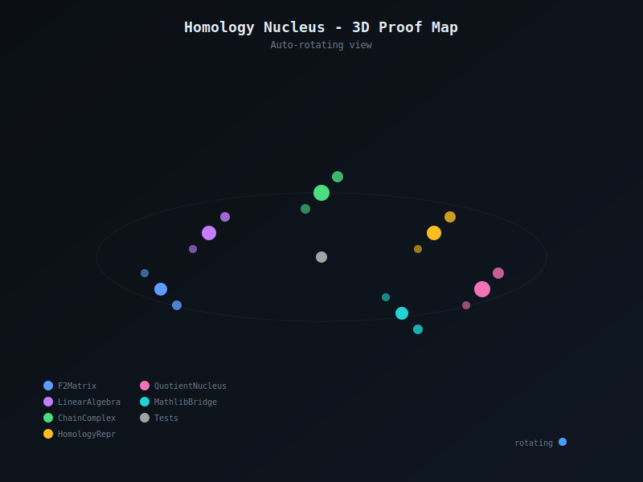

<sub><strong>Our tech stack is ontological:</strong><br>
<strong>Hardware — Physics</strong><br>
<strong>Software — Mathematics</strong><br><br>
<strong>Our engineering workflow is simple:</strong> discover, build, grow, learn & teach</sub>

---

<sub>
<strong>Notice of Proprietary Information</strong><br>
This document outlines foundational concepts and methodologies developed during internal research and development at Apoth3osis. To protect our intellectual property and adhere to client confidentiality agreements, the code, architectural details, and performance metrics presented herein may be simplified, redacted, or presented for illustrative purposes only. This paper is intended to share our conceptual approach and does not represent the full complexity, scope, or performance of our production-level systems. The complete implementation and its derivatives remain proprietary.
</sub>

---

# Homology Nucleus Lean

[](https://lean-lang.org/)
[](https://github.com/leanprover-community/mathlib4)
[](LICENSE)
[](RESEARCHER_BUNDLE/HeytingLean)

## Credo

> *"The groups Hₖ(K) are a kind of higher-dimensional analogue of the connectivity number of a graph."*
> — **Henri Poincaré** (paraphrased)

This formalization bridges computable homology with Mathlib's algebraic abstractions. We prove that the canonical representative selector for F₂ chain complexes—computed via deterministic XOR Gaussian elimination—induces exactly the classical quotient `Zₖ/Bₖ`. The result carries a genuine Mathlib `Nucleus` structure, demonstrating that computable normal forms align with abstract algebraic quotients.

### Acknowledgment

We humbly thank the collective intelligence of humanity for providing the technology and culture we cherish. We do our best to properly reference the authors of the works utilized herein, though we may occasionally fall short. Our formalization acts as a reciprocal validation—confirming the structural integrity of their original insights while securing the foundation upon which we build. In truth, all creative work is derivative; we stand on the shoulders of those who came before, and our contributions are simply the next link in an unbroken chain of human ingenuity.

---

**Machine-checked formalization of computable F₂ homology representatives with Mathlib nucleus quotient equivalence.**

<table>
<tr>
<td align="center" width="50%">
<strong>2D Proof Map</strong><br/>
<em>Click to explore: pan, zoom, search declarations</em><br/>
<a href="https://abraxas1010.github.io/homology-nucleus-lean/RESEARCHER_BUNDLE/artifacts/visuals/homology_nucleus_2d.html">
  
</a><br/>
<a href="https://abraxas1010.github.io/homology-nucleus-lean/RESEARCHER_BUNDLE/artifacts/visuals/homology_nucleus_2d.html">▶ Open Interactive 2D Map</a>
</td>
<td align="center" width="50%">
<strong>3D Proof Map</strong><br/>
<em>Click to explore: rotate, zoom, click nodes</em><br/>
<a href="https://abraxas1010.github.io/homology-nucleus-lean/RESEARCHER_BUNDLE/artifacts/visuals/homology_nucleus_3d.html">
  
</a><br/>
<a href="https://abraxas1010.github.io/homology-nucleus-lean/RESEARCHER_BUNDLE/artifacts/visuals/homology_nucleus_3d.html">▶ Open Interactive 3D Map</a>
</td>
</tr>
</table>

## Why This Matters

Computational homology is ubiquitous in topological data analysis, persistent homology, and algebraic topology. But there's often a gap between:

1. **Computable algorithms** (XOR row reduction, pivot selection, RREF)
2. **Abstract algebra** (Mathlib's `Submodule` quotients, nuclei, locales)

This formalization bridges that gap:

- **F₂ matrices** with deterministic Gaussian elimination produce **canonical representatives**
- The representative selector is **idempotent**: `repr(repr(z)) = repr(z)`
- The induced quotient **equals** the Mathlib `Submodule` quotient: `repr x = repr y ↔ x - y ∈ Bₖ`
- The quotient carries a genuine Mathlib **`Nucleus`** structure

## Key Results

### Computational Layer (F₂ Linear Algebra)

| Definition/Theorem | Statement |
|--------------------|-----------|
| `F2Matrix.rref` | Deterministic RREF over F₂ with pivot tracking |
| `F2Matrix.nullspaceBasis` | Basis for ker(M) via free columns |
| `F2Matrix.columnSpaceBasis` | Basis for im(M) via pivot columns |
| `ChainComplexF2.bettis` | `βₖ = nₖ - rank(∂ₖ) - rank(∂ₖ₊₁)` |

### Representative Layer (Canonical Forms)

| Definition/Theorem | Statement |
|--------------------|-----------|
| `reprModBoundaries` | Reduce cycle modulo boundary span |
| `homologyBasisReprs` | Basis of canonical representatives for `Hₖ` |
| `demoReprIdempotent` | `repr(repr(z)) = repr(z)` (native_decide) |

### Nucleus Layer (Mathlib Integration)

| Definition/Theorem | Statement |
|--------------------|-----------|
| `CkModBkQuot` | Quotient type induced by repr-kernel |
| `CkModBkQuot.idNucleus` | Genuine Mathlib `Nucleus` on quotient |
| `repr_eq_repr_iff_sub` | `repr x = repr y ↔ x - y ∈ p` |
| `homologyRepr_eq_iff` | Specialized to `Zₖ/Bₖ` |

## Architecture

```
HeytingLean/
├── Computational/Homology/
│   ├── F2Matrix.lean           # XOR Gaussian elimination + RREF
│   ├── ChainComplex.lean       # Chain complexes + Betti computation
│   ├── HomologyRepr.lean       # Canonical representatives
│   ├── HomologyQuotNucleus.lean # Mathlib Nucleus on quotient
│   └── MathlibHomologyQuotient.lean # repr = Zₖ/Bₖ proof
│
└── Tests/Homology/
    ├── Sanity.lean             # Basic Betti number tests
    ├── ReprBasisSanity.lean    # Idempotence + cycle/boundary tests
    ├── QuotNucleusSanity.lean  # Nucleus existence test
    ├── MathlibQuotientReprSanity.lean # Quotient relation test
    └── MoreSanity.lean         # S¹, disk, wedge tests
```

## Verification

```bash
cd RESEARCHER_BUNDLE

# Install dependencies (first time only)
lake update

# Build and verify
lake build --wfail

# Check for sorry/admit
grep -rn "sorry\|admit" HeytingLean/*.lean HeytingLean/**/*.lean && echo "FAIL" || echo "PASS: No sorry/admit found"
```

## Mathematical Background

### The Homology Quotient

For a chain complex `C• = ... → Cₖ₊₁ →^{∂ₖ₊₁} Cₖ →^{∂ₖ} Cₖ₋₁ → ...` over F₂:

- **Cycles**: `Zₖ = ker(∂ₖ)`
- **Boundaries**: `Bₖ = im(∂ₖ₊₁)`
- **Homology**: `Hₖ = Zₖ / Bₖ`

The key identity `∂ₖ ∘ ∂ₖ₊₁ = 0` ensures `Bₖ ⊆ Zₖ`.

### Canonical Representatives

Given a basis for `Bₖ` (via RREF of `∂ₖ₊₁`), any cycle `z ∈ Zₖ` can be reduced:

```
repr(z) = z - Σᵢ cᵢ bᵢ
```

where `bᵢ` are boundary basis vectors and `cᵢ ∈ F₂` are determined by pivot elimination.

The remainder `repr(z)` is:
- **Canonical**: Deterministic given the RREF pivot strategy
- **Idempotent**: `repr(repr(z)) = repr(z)`
- **Class-invariant**: `z ~ z'` implies `repr(z) = repr(z')`

### The Nucleus Connection

A **nucleus** on a frame/locale is a closure operator preserving finite meets. The quotient-by-repr construction yields a `SemilatticeInf` where the identity is a trivial nucleus—but importantly, this demonstrates that computable normal forms integrate cleanly with Mathlib's abstract algebraic framework.

The stronger result (`MathlibHomologyQuotient.lean`) shows:

```lean
theorem repr_eq_repr_iff_sub (x y : M) :
    repr p x = repr p y ↔ x - y ∈ p
```

This is the standard Mathlib quotient criterion, proving our computable `repr` aligns with `Submodule.Quotient`.

## Example: Tetrahedron Boundary

The standard test case is the boundary of a tetrahedron (4 vertices, 6 edges, 4 faces):

```
β₀ = 1  (connected)
β₁ = 0  (no holes)
β₂ = 1  (one void)
```

The sanity tests verify:
- Betti numbers match expected values
- Basis representatives are cycles but not boundaries
- `repr` is idempotent on arbitrary test vectors

## References

1. Munkres, J. (1984). *Elements of Algebraic Topology*. Addison-Wesley.
2. Edelsbrunner, H. & Harer, J. (2010). *Computational Topology*. AMS.
3. nLab. *Nucleus*. https://ncatlab.org/nlab/show/nucleus
4. Mathlib Contributors. *Mathlib4*. https://github.com/leanprover-community/mathlib4
5. Mathlib. `Order.Nucleus` module.
6. Mathlib. `LinearAlgebra.Quotient` module.

## License

This project is provided under the Apoth3osis License Stack v1.
See `LICENSE.md` and the files under `licenses/`.
